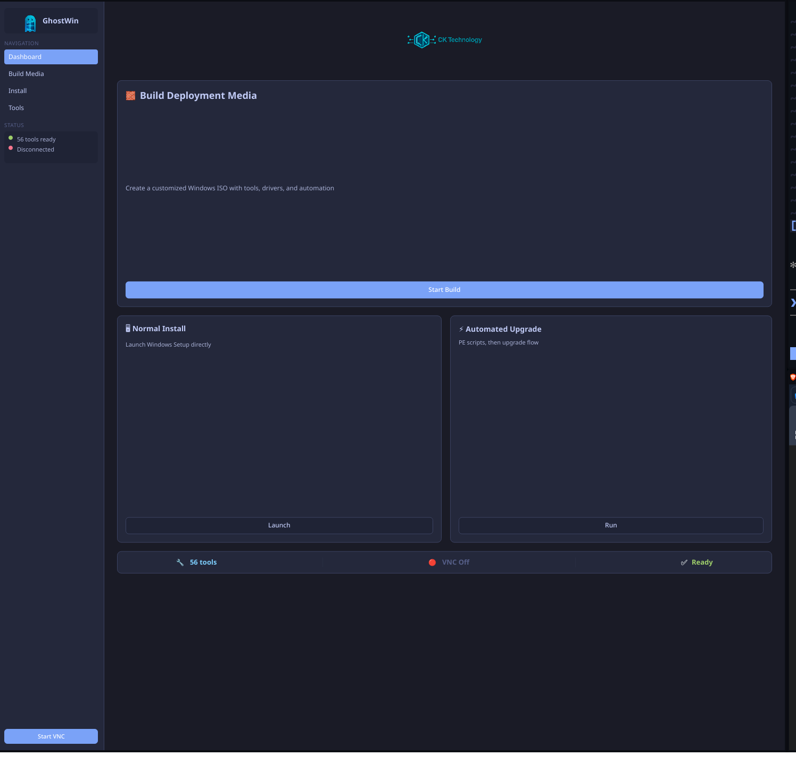

# GhostWin

[](https://www.microsoft.com/windows)
[](https://www.rust-lang.org/)
[](https://github.com/ghostkellz/ghostwin)
[](https://github.com/ghostkellz/ghostwin)



**GhostWin** is a modern, secure, and Rust-powered Windows deployment toolkit designed for IT professionals. Built with simplicity, automation, and powerful customization in mind, GhostWin provides a fast and reliable interface for building custom Windows installer images with embedded scripts, tools, and user-driven options.

> ✅ Built for **Resolve Technology** in collaboration with **Christopher Kelley**


**GhostWin** is a modern, secure, and Rust-powered Windows deployment toolkit designed for IT professionals. Built with simplicity, automation, and powerful customization in mind, GhostWin provides a fast and reliable interface for building custom Windows installer images with embedded scripts, tools, and user-driven options.

> ✅ Built for **Resolve Technology** in collaboration with \*\*Christopher Kelley \*\*stWin

**GhostWin** is a modern, secure, and Rust-powered Windows deployment toolkit designed for IT professionals. Built with simplicity, automation, and powerful customization in mind, GhostWin provides a fast and reliable interface for building custom Windows installer images with embedded scripts, tools, and user-driven options.

> ✅ Built for **Resolve Technology** in collaboration with \*\*Christopher Kelley \*\*

---

## ✨ Goals

* **Rust-native ISO builder** for Windows-based WinPE environments
* **CLI and GUI workflows** for power users and technicians
* **Built-in automation** for post-install scripts, tool inclusion, driver injection
* **Flexible folder-based config system** for layout and tool registration
* **Remote-friendly** with optional VNC/mesh VPN integrations
* **Better DX than DISM/Build.bat** workflows

---

## 🛠️ Planned Features

| Feature                   | Status         | Notes                                       |
| ------------------------- | -------------- | ------------------------------------------- |
| Build custom WinPE ISOs   | 🟨 In Progress | Clean Rust CLI instead of batch scripts     |
| Integrate scripts & tools | 🟩 Done        | Folder-based detection (`/Tools`, `/Logon`) |
| GUI frontend in WinPE     | � Done        | Slint-based native GUI with dark theme      |
| VNC & remote access       | � Done        | TightVNC integration and status display     |
| Driver injection          | 🟨 Planned     | `PEAutoRun/Drivers/` detection              |
| Logon script selector     | 🟨 In Progress | With background/system context flags        |
| `ghostwin build` CLI tool | 🟨 In Progress | Replaces `Build.bat` completely             |

---

## 🧰 Toolkit

GhostWin includes:

* 📦 [7-Zip](https://www.7-zip.org/) — Compression + ISO extraction
* 📁 Explorer++ — WinPE file browser
* 🧠 Sysinternals Suite — Disk2VHD, Autoruns, etc.
* 🔍 NirSoft Utilities — Device + event log explorers
* 💡 ReactOS Paint — Image viewer
* 🔧 NTPWEdit — Local account password reset
* 🧪 CrystalDisk, GSmartControl — Disk health & benchmarks
* 🔐 Optional: Netbird or Tailscale support for remote/mesh connectivity

---

## 🖥️ GUI Interface

The GhostWin GUI launches inside WinPE with a professional dark ocean blue theme and intuitive layout:

**🎯 Main Features:**
* **Installation Modes**: "Normal Install" (no modifications) and "Automated Install" (full automation)
* **Tool Management Center**: System tools and automation scripts organized in dedicated sections
* **VNC Remote Access**: Integrated controls with real-time connection status
* **Professional Theme**: Deep ocean blue design optimized for deployment environments
* **Real-time Status**: System information panel showing tool count and deployment readiness

**🎨 UI Framework:**
* **Slint**: ✅ **Implemented** – native WinPE rendering, minimal dependencies, pure Rust compatible
* Modern dark theme with professional branding
* Responsive layout optimized for various screen resolutions

---

## 🔧 ISO Creation

GhostWin's `ghostwin build` CLI tool will:

1. Mount the Windows boot.wim image
2. Inject GhostWin helper + user scripts/tools
3. Inject WinPE packages from ADK
4. Modify registry if needed (e.g., DPI fix)
5. Unmount and commit WIM changes
6. Rebuild a bootable ISO using `oscdimg`

### Requirements:

* Windows ADK + WinPE Add-on
* Rust (1.78+) + `ghostwin` CLI
* Base Windows 11 ISO

---

## 🔒 Security

* No modifications to install.wim by default
* Scripts and tools are user-injected and logged
* Optional remote access tools are encrypted & ephemeral
* ISO builds are reproducible via config file

---

## 🧱 Project Structure

```
ghostwin/
├── ghostwin.exe
├── ghostwin.toml          # Configuration file
├── tools/                 # System tools
├── scripts/               # Build scripts
├── pe_autorun/           # Auto-run scripts
├── resources/            # Fonts, icons, etc
└── config/               # Default configurations
```

---

## 📜 License

MIT License — see LICENSE file.

---

## 🤝 Contributors

* **Resolve Technology**
* **Christopher Kelley** (@ghostkellz / CK Technology)

---

More soon at: [cktechnology.io](https://cktechnology.io) and [ghostkellz.sh](https://ghostkellz.sh)

---

> Want to automate wiping and staging machines at scale? GhostWin is your sidekick.

