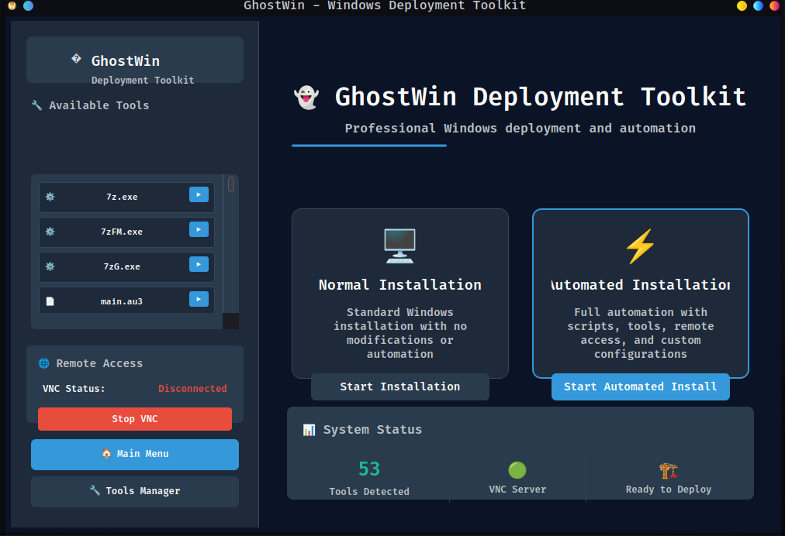

# GhostWin 👻

[](https://www.microsoft.com/windows)
[](https://www.rust-lang.org/)
[](https://github.com/CK-Technology/ghostwin)
[](https://github.com/CK-Technology/ghostwin)



**GhostWin is your Windows setup automation sidekick, no more hackery to make a local Windows account - no account required!** 

A modern, secure, and Rust-powered Windows deployment toolkit designed for IT professionals. Built with simplicity, automation, and powerful customization in mind, GhostWin provides a fast and reliable interface for building custom Windows installer images with embedded scripts, tools, and user-driven options.

> ✅ Built for **Resolve Technology** in collaboration with **Christopher Kelley**

---

## 🚀 Quick Start

### One-Line Install (Windows)
```powershell
iwr -useb https://raw.githubusercontent.com/CK-Technology/ghostwin/main/install.ps1 | iex
```

### Launch GUI
```bash
ghostwin gui
```

### Build Custom ISO
```bash
ghostwin build --source-iso Windows11.iso --output-iso GhostWin.iso
```

**📖 Need detailed setup instructions?** Check out [GUNPOWDER.md](GUNPOWDER.md) for a step-by-step guide with personality!

---

## ✨ Goals

* **Rust-native ISO builder** for Windows-based WinPE environments
* **CLI and GUI workflows** for power users and technicians
* **Built-in automation** for post-install scripts, tool inclusion, driver injection
* **Flexible folder-based config system** for layout and tool registration
* **Remote-friendly** with optional VNC/mesh VPN integrations
* **Better DX than DISM/Build.bat** workflows

---

## ✨ Key Features

🎨 **Modern GUI Interface**
- Professional dark ocean blue theme optimized for WinPE environments
- Intuitive tool management with organized system and automation sections
- Real-time status displays and deployment progress tracking

🔧 **Powerful Automation**
- One-click deployment modes: Normal and Automated installation
- Integrated script execution for registry tweaks and system configuration
- Auto-detection and organization of tools across multiple directories

🌐 **Remote Access Ready**
- Built-in VNC server with connection management
- Secure remote assistance capabilities for complex deployments
- Real-time connectivity status and controls

⚡ **Performance & Reliability**
- Rust-native implementation for speed and memory safety
- Minimal dependencies optimized for WinPE environments
- Robust error handling and recovery mechanisms

---

## 🚀 Installation

### Prerequisites
- **Windows 10/11** with Administrator privileges
- **20GB+ free disk space** for ISO building
- **Internet connection** for dependency downloads

### Dependencies (Automatically Handled)
The installer automatically detects and installs required dependencies:
- **🔧 Visual Studio Build Tools** — Required for Windows compilation
- **🦀 Rust Toolchain** — For building from source (skippable with `-PreBuilt`)
- **📦 Windows ADK** — Assessment and Deployment Kit (via `winget` or manual download)
- **🔌 Windows PE Add-on** — Preinstallation Environment support (via `winget` or manual download)

> **💡 Tip**: The installer uses `winget` as the primary method for ADK/PE installation with automatic fallback to manual downloads if `winget` is unavailable.

### Automated Installation (Recommended)
```powershell
# Full installation with dependency handling
iwr -useb https://raw.githubusercontent.com/CK-Technology/ghostwin/main/install.ps1 | iex

# Quick install with pre-built binaries (faster)
iwr -useb https://raw.githubusercontent.com/CK-Technology/ghostwin/main/install.ps1 | iex -PreBuilt

# Custom installation path
iwr -useb https://raw.githubusercontent.com/CK-Technology/ghostwin/main/install.ps1 | iex -InstallPath "C:\Tools\GhostWin"
```

**🎯 Installation Features:**
- 🤖 **Smart dependency detection** — Checks for all required components
- 📦 **Winget integration** — Modern package management for ADK/PE installation
- 🔄 **Automatic fallback** — Direct downloads if winget unavailable
- ⚡ **Pre-built option** — Skip compilation for faster setup
- 🛡️ **Error handling** — Clear guidance when issues occur

### Manual Installation
1. **Install Rust**: Download from [rustup.rs](https://rustup.rs/)
2. **Clone Repository**: `git clone https://github.com/ghostkellz/ghostwin.git`
3. **Build Project**: `cargo build --release`
4. **Verify**: `./target/release/ghostwin.exe --version`

**📖 Detailed Setup Guide**: Check [GUNPOWDER.md](GUNPOWDER.md) for step-by-step instructions!

### Troubleshooting

**⚠️ Installation Issues?** See [TROUBLESHOOTING.md](TROUBLESHOOTING.md) for common solutions:
- 🔧 **"Updating crates.io index" hangs** → Use `-PreBuilt` or `-FixCargo`
- 🔗 **Network/firewall issues** → Corporate proxy configuration
- 🛡️ **Permission denied errors** → Administrator privileges and antivirus exclusions
- 📦 **Missing dependencies** → Automatic dependency installation guides

---

## 🧰 Toolkit

GhostWin includes:

* 📦 [7-Zip](https://www.7-zip.org/) — Compression + ISO extraction
* 📁 Explorer++ — WinPE file browser
* 🧠 Sysinternals Suite — Disk2VHD, Autoruns, etc.
* 🔍 NirSoft Utilities — Device + event log explorers
* 💡 ReactOS Paint — Image viewer
* 🔧 NTPWEdit — Local account password reset
* 🧪 CrystalDisk, GSmartControl — Disk health & benchmarks
* 🔐 Optional: Netbird or Tailscale support for remote/mesh connectivity

---

## 🖥️ GUI Interface

The GhostWin GUI launches inside WinPE with a professional dark ocean blue theme and intuitive layout:

**🎯 Main Features:**
* **Installation Modes**: "Normal Install" (no modifications) and "Automated Install" (full automation)
* **Tool Management Center**: System tools and automation scripts organized in dedicated sections
* **VNC Remote Access**: Integrated controls with real-time connection status
* **Professional Theme**: Deep ocean blue design optimized for deployment environments
* **Real-time Status**: System information panel showing tool count and deployment readiness

**🎨 UI Framework:**
* **Slint**: ✅ **Implemented** – native WinPE rendering, minimal dependencies, pure Rust compatible
* Modern dark theme with professional branding
* Responsive layout optimized for various screen resolutions

---

## 🔧 ISO Creation

GhostWin's `ghostwin build` CLI tool will:

1. Mount the Windows boot.wim image
2. Inject GhostWin helper + user scripts/tools
3. Inject WinPE packages from ADK
4. Modify registry if needed (e.g., DPI fix)
5. Unmount and commit WIM changes
6. Rebuild a bootable ISO using `oscdimg`

### Requirements:

* Windows ADK + WinPE Add-on
* Rust (1.78+) + `ghostwin` CLI
* Base Windows 11 ISO

---

## 🔒 Security

* No modifications to install.wim by default
* Scripts and tools are user-injected and logged
* Optional remote access tools are encrypted & ephemeral
* ISO builds are reproducible via config file

---

## 🧱 Project Structure

```
ghostwin/
├── ghostwin.exe
├── ghostwin.toml          # Configuration file
├── tools/                 # System tools
├── scripts/               # Build scripts
├── pe_autorun/           # Auto-run scripts
├── resources/            # Fonts, icons, etc
└── config/               # Default configurations
```

---

## 🗺️ Development Roadmap

| Feature                   | Status         | Notes                                       |
| ------------------------- | -------------- | ------------------------------------------- |
| Build custom WinPE ISOs   | 🟨 In Progress | Clean Rust CLI instead of batch scripts     |
| Integrate scripts & tools | 🟩 Done        | Folder-based detection (`/Tools`, `/Logon`) |
| GUI frontend in WinPE     | 🟩 Done        | Slint-based native GUI with dark theme      |
| VNC & remote access       | 🟩 Done        | TightVNC integration and status display     |
| Driver injection          | 🟨 Planned     | `PEAutoRun/Drivers/` detection              |
| Logon script selector     | 🟨 In Progress | With background/system context flags        |
| `ghostwin build` CLI tool | 🟨 In Progress | Replaces `Build.bat` completely             |

---

## 📜 License

MIT License — see LICENSE file.

---

## 🤝 Contributors

* **Resolve Technology**
* **Christopher Kelley** (@ghostkellz / CK Technology)

---

## 🔗 Links & Resources

**📖 Documentation**
- [Setup Guide (GUNPOWDER.md)](GUNPOWDER.md) - Step-by-step setup with personality
- [Technical Documentation (DOCS.md)](DOCS.md) - Complete technical reference
- [Command Reference (COMMANDS.md)](COMMANDS.md) - CLI command documentation

**🌐 Online**
- [CK Technology](https://cktechx.com) - Professional IT services
- [GhostKellz](https://ghostkellz.sh) - Developer portfolio and tools

**🛠️ Tools & Scripts**
- [Tool Collection](tools/) - System utilities and diagnostic tools
- [Automation Scripts](scripts/) - Deployment and configuration automation
- [PE AutoRun](pe_autorun/) - Boot-time script execution

---

> **GhostWin is your Windows setup automation sidekick, no more hackery to make a local Windows account - no account required!** 🚀
